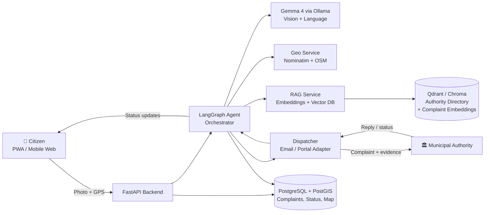
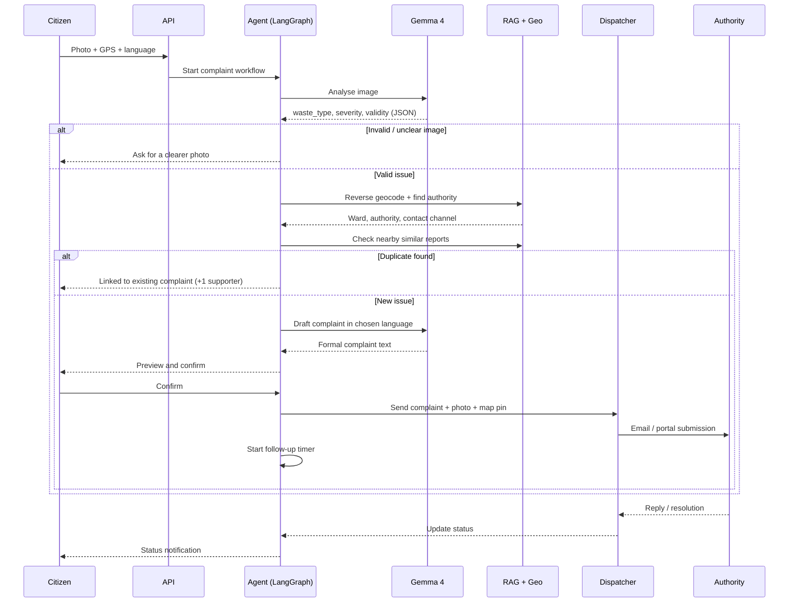
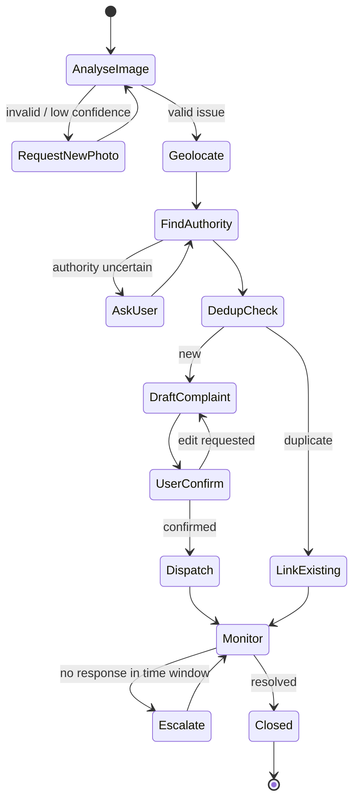

# 🗑️ CivicSnap

**Snap a photo of roadside garbage. An open-source AI agent files the complaint, tracks it, and escalates it for you.**

---
### 👥 Team: TeamX
 
| Member |
|---|
| Shivam |
| Kshitij |
| Parag |
| Rudra |
 
---

## Table of Contents
1. [Project Name](#1-project-name)
2. [Problem Statement](#2-problem-statement)
3. [Project Overview](#3-project-overview)
4. [Proposed Solution](#4-proposed-solution)
5. [Objectives](#5-objectives)
6. [Target Users / Use Case](#6-target-users--use-case)
7. [Open-Source AI Technology Selected](#7-open-source-ai-technology-selected)
8. [Why This Technology Was Selected](#8-why-this-technology-was-selected)
9. [AI's Role in the System](#9-ais-role-in-the-system)
10. [System Architecture](#10-system-architecture)
11. [Component-Level Architecture](#11-component-level-architecture)
12. [Data / Information Flow](#12-data--information-flow)
13. [Agentic Workflow](#13-agentic-workflow)
14. [Technology Stack](#14-technology-stack)
15. [Expected Features](#15-expected-features)
16. [Implementation Approach](#16-implementation-approach)
17. [Expected Final Output](#17-expected-final-output)
18. [Future Scope / Scalability](#18-future-scope--scalability)
19. [Open-Source Dependencies / Components](#19-open-source-dependencies--components)
20. [Expected Challenges and Mitigation](#20-expected-challenges-and-mitigation)

---

## 1. Project Name
**CivicSnap** — *from a photo to a filed complaint in under a minute.*

## 2. Problem Statement
Garbage dumped on roadsides is a daily public-health and environmental problem in Indian towns and cities. Citizens usually do notice it, but rarely report it, because reporting is hard:

- They don't know **which authority** is responsible for that exact spot (ward office, municipal corporation, panchayat, sanitation contractor).
- Complaint portals and helplines are fragmented, slow, and often available only in one language.
- Complaints are **vague** (no exact location, no evidence, no severity), so they are ignored or closed without action.
- There is **no follow-up**: citizens don't know the status and nobody escalates stale complaints.
- Many people report the same pile of garbage separately, which clutters the system.

The result is a gap between *seeing* a problem and *getting it resolved*.

## 3. Project Overview
CivicSnap is an **agentic, multimodal AI application**. The user takes one photo. A locally served open-weight vision-language model (**Gemma 4**) understands what is in the image, and an agent orchestrates everything else: locating the spot, identifying the responsible authority, writing a proper complaint in the right language, filing it, and following up until it is resolved.

The AI is the core of the system, not an add-on. Without it, the app would need the user to classify the waste, find the authority, and write the complaint by hand.

## 4. Proposed Solution
A mobile-friendly web app (PWA) plus a backend agent service:

1. **See:** Gemma 4 analyses the photo and returns structured facts (waste type, severity, hazards, whether it is a valid civic issue).
2. **Locate:** GPS and EXIF data are reverse-geocoded using OpenStreetMap to a ward / zone / locality.
3. **Route:** A RAG lookup over an authority directory finds the responsible office and contact channel for that location and waste type.
4. **Write:** The agent drafts a complete, evidence-backed complaint in English or the user's local language.
5. **File:** The complaint is dispatched through the available channel (email / portal adapter) with the photo and map pin attached.
6. **Follow up:** The agent deduplicates repeat reports, tracks status, and automatically sends escalations if there is no response within a set time.

## 5. Objectives
- Cut the effort of reporting a civic issue to **one photo and one confirmation tap**.
- Produce complaints that are **specific, evidenced, and correctly routed**, so they are actionable.
- Make **follow-up and escalation automatic**, so complaints are not silently forgotten.
- Reduce duplicate complaints by **grouping nearby reports** of the same issue.
- Show a **privacy-preserving, low-cost, fully open-source** AI pipeline that can run on local hardware.

## 6. Target Users / Use Case

| User | Need | How CivicSnap helps |
|---|---|---|
| **Citizens / students** | Report garbage quickly without knowing the system | Photo in, complaint out |
| **Resident welfare associations, NGOs, college clubs** | Run cleanliness drives and keep a record | Shared map and complaint history |
| **Municipal / ward officers** | Get clear, located, prioritised complaints | Structured reports with severity and photo evidence |

**Primary use case:** A person walking past an overflowing garbage dump opens CivicSnap, takes a photo, reviews the pre-filled complaint, and taps *Submit*.

## 7. Open-Source AI Technology Selected

| Component | Technology | Purpose |
|---|---|---|
| Vision-language model | **Gemma 4** (open-weight, multimodal) | Understand the garbage photo; draft multilingual complaints |
| Local inference | **Ollama / llama.cpp** | Serve a quantized Gemma 4 on modest hardware |
| Agent framework | **LangGraph** | Stateful, multi-step agent workflow with tool calls |
| Embeddings | **Open-source sentence-embedding model** (e.g. multilingual MiniLM / BGE) | Authority directory retrieval and duplicate detection |
| Vector database | **Qdrant or ChromaDB** | Store authority directory and past-complaint embeddings |
| Geo data | **OpenStreetMap + Nominatim** | Reverse geocoding and administrative boundaries |

## 8. Why This Technology Was Selected
The choice is driven by the problem, not by popularity.

- **Why Gemma 4:** The core input is an *image*, and the outputs need *structured reasoning* (waste type, severity) and *multilingual text* (complaints). A single multimodal open-weight model covers both, so we avoid stitching together separate vision, translation and generation models.
- **Why open-source / local:** Citizen photos can contain faces, vehicle plates, and home locations. Running the model locally means **no photo leaves our infrastructure** except in the filed complaint. It also removes per-call API costs, which matters for a civic tool that should be free for citizens and affordable for municipalities.
- **Why a quantized local model:** It lets the system run on a single modest GPU or even CPU for demos, and lets a city deploy it on its own servers.
- **Why LangGraph:** The workflow has branches (invalid image, unknown authority, duplicate found) and retries. A graph with explicit state is more reliable and debuggable than a single long prompt.
- **Why RAG for authorities:** Contact details and jurisdictions change and are different in every city. Retrieval keeps them in an editable directory instead of baked into model weights, which would cause hallucinated contacts.

## 9. AI's Role in the System
AI performs the steps that normally need a human:

| Step | AI task | Output |
|---|---|---|
| Perception | Gemma 4 analyses the image | JSON: `waste_type`, `severity`, `hazards`, `is_valid_issue`, `confidence` |
| Verification | Rejects irrelevant or unclear photos | Ask user to retake the photo |
| Routing | Agent reasons over location + waste type + retrieved directory entries | Responsible authority and channel |
| Writing | Gemma 4 composes the complaint | Formal complaint in the chosen language |
| Deduplication | Embedding similarity within a radius and time window | Link to an existing report instead of a new one |
| Follow-up | Agent decides when and how to escalate | Reminder or escalation message |

Remove the AI and the app falls back to a manual form, so the AI is central to the solution.

## 10. System Architecture

## 11. Component-Level Architecture

| # | Component | Responsibility | Interacts with |
|---|---|---|---|
| 1 | **Frontend PWA** | Camera capture, GPS, complaint preview, status tracking, public map | Backend API |
| 2 | **API Layer (FastAPI)** | Auth-light sessions, uploads, REST endpoints | Frontend, Orchestrator |
| 3 | **Agent Orchestrator (LangGraph)** | Runs the stateful workflow; calls tools; handles branches and retries | All services |
| 4 | **Vision-Language Service** | Gemma 4 served locally; image analysis and text generation with structured (JSON) output | Orchestrator |
| 5 | **Geo Service** | Reverse geocoding; ward / zone lookup from boundaries | Orchestrator |
| 6 | **Authority Directory + RAG** | Retrieves the responsible office, contact, and channel for a location and issue type | Orchestrator, Vector DB |
| 7 | **Deduplication Module** | Finds similar reports nearby using geo-radius plus embedding similarity | PostGIS, Vector DB |
| 8 | **Dispatcher** | Sends the complaint (email in the final; portal adapters as future work) and receives replies | Orchestrator |
| 9 | **Follow-up Scheduler** | Timers for reminders and escalation to a higher authority | Orchestrator, Dispatcher |
| 10 | **Storage** | PostgreSQL/PostGIS for records; vector DB for embeddings; object store for images | All |

## 12. Data / Information Flow

**Input / output summary**

| Stage | Input | Output |
|---|---|---|
| Perception | Image | Structured JSON analysis |
| Location | Latitude/longitude | Ward, zone, address |
| Routing | Location + waste type | Authority + channel |
| Drafting | Facts + authority + language | Complaint text |
| Dispatch | Complaint + evidence | Reference ID + status |
| Follow-up | Status + timer | Reminder / escalation |

## 13. Agentic Workflow

The agent is a **LangGraph state machine**. Each node is a tool-using step and the shared state carries the evidence collected so far.

**Agent design principles**
- **Human in the loop:** the user always confirms before anything is sent.
- **Structured outputs:** Gemma 4 is constrained to a JSON schema for image analysis so downstream steps are reliable.
- **Grounded routing:** authority names and contacts come only from the retrieved directory, never from model memory.
- **Confidence gates:** low-confidence perception or routing triggers a question to the user rather than a guess.

## 14. Technology Stack

| Layer | Choice |
|---|---|
| Frontend | React PWA, Leaflet (map), browser Camera and Geolocation APIs |
| Backend | Python, FastAPI |
| Agent orchestration | LangGraph |
| AI model | Gemma 4 (quantized), served with Ollama / llama.cpp |
| Embeddings | Open-source multilingual embedding model |
| Vector DB | Qdrant or ChromaDB |
| Database | PostgreSQL + PostGIS |
| Geo | OpenStreetMap, Nominatim |
| Messaging | SMTP email (final); webhook adapter interface for portals |
| Scheduling | APScheduler (follow-up timers) |
| Deployment | Docker Compose (single-command local deployment) |

## 15. Expected Features

**Core (targeted for the final hackathon)**
- 📸 One-photo reporting with automatic GPS capture
- 🧠 Gemma 4 waste classification and severity scoring with a validity check
- 📍 Automatic ward / authority identification via RAG over a seeded directory (one demo city)
- ✍️ Auto-written formal complaint in English plus one local language (e.g. Hindi)
- ✅ User confirmation and edit step before sending
- 📧 Complaint dispatch by email with photo evidence and map pin
- 🔁 Duplicate detection (geo-radius plus embedding similarity)
- ⏱️ Status tracking with automatic reminder / escalation timers
- 🗺️ Public map of reported and resolved issues

**Stretch**
- Before/after photo comparison to verify cleanup
- Voice-note complaints
- Hotspot analytics dashboard for authorities

## 16. Implementation Approach

The final round is short, so the plan is a **vertical slice first**, then breadth.

| Phase | Work | Result |
|---|---|---|
| 1. Foundations | Docker Compose, FastAPI skeleton, Ollama with Gemma 4, PostGIS | Services running locally |
| 2. Perception | Prompt and JSON schema for waste analysis; validity and confidence checks | Photo in, structured analysis out |
| 3. Location and routing | Reverse geocoding; seeded authority directory for one city; RAG retrieval | Correct authority for a pin |
| 4. Agent graph | LangGraph workflow with branches, user confirmation and state | End-to-end pipeline |
| 5. Dispatch and follow-up | Email sending, mock authority inbox, status timers, escalation | Complaint filed and tracked |
| 6. Frontend | PWA camera flow, preview, status page, map | Usable demo |
| 7. Evaluation and polish | Test on a small labelled photo set; measure classification accuracy and routing correctness; write demo script | Evidence for judges |

**Scope control:** one pilot city, one filing channel (email), two languages, and a mock authority inbox for the live demo so the demo does not depend on any real government system.

**Evaluation plan:** a small set of real-world garbage photos (collected for testing, not committed to this repo) is used to measure waste-type accuracy, validity rejection rate, routing correctness, duplicate detection precision, and end-to-end latency.

## 17. Expected Final Output
A **working, Dockerized prototype** where an evaluator can:

1. Open the web app on a phone, take (or upload) a photo of garbage.
2. See Gemma 4's structured analysis and the identified authority.
3. Review and confirm an auto-generated complaint in English or Hindi.
4. Watch the complaint arrive in a demo authority inbox with photo and map pin.
5. See the status update and an automatic escalation after a shortened demo timer.
6. View the report on the public map, and see a second nearby photo get linked as a duplicate.

The project will be published in a **public GitHub repository under an open-source license** with setup instructions and a demo video.

## 18. Future Scope / Scalability
- **Beyond garbage:** potholes, broken streetlights, open drains, water leaks, and illegal dumping, using the same pipeline with new issue types and directory entries.
- **More channels:** official municipal portals, WhatsApp, Telegram, and social media tagging through adapter plugins.
- **More cities and languages:** the authority directory is data, so adding a city does not need code changes. Gemma's multilingual ability supports more regional languages.
- **Authority dashboard:** ward-level heatmaps, recurring hotspots, and resolution-time analytics for planning.
- **Cleanup verification:** before/after image comparison to confirm real resolution.
- **Scaling infrastructure:** stateless API workers, a queue between the API and agent workers, and a model server that can scale horizontally.
- **Community layer:** volunteers, NGOs and college clubs can adopt and track local spots.

## 19. Open-Source Dependencies / Components

| Component | Role | License type |
|---|---|---|
| Gemma 4 | Multimodal reasoning and generation | Open-weight (Gemma terms of use) |
| Ollama / llama.cpp | Local model serving | MIT |
| LangGraph | Agent orchestration | MIT |
| FastAPI | Backend API | MIT |
| Qdrant / ChromaDB | Vector search | Apache-2.0 |
| Open-source embedding model | Semantic retrieval and dedup | Permissive (model-specific) |
| PostgreSQL + PostGIS | Spatial database | PostgreSQL / GPL (extension) |
| OpenStreetMap / Nominatim | Geocoding and boundaries | ODbL / GPL |
| React + Leaflet | Frontend and maps | MIT / BSD |
| APScheduler | Scheduled follow-ups | MIT |
| Docker / Docker Compose | Packaging and deployment | Apache-2.0 |

*Final license details will be verified for each dependency before release.*

## 20. Expected Challenges and Mitigation

| Challenge | Risk | Mitigation |
|---|---|---|
| **Model misclassification** (e.g. a construction pile mistaken for garbage) | Wrong or invalid complaints | Validity check and confidence threshold; user confirmation before filing; retake prompt |
| **Hallucinated authority details** | Complaint sent to the wrong office | Routing only from a curated directory via RAG; ask the user when retrieval confidence is low |
| **Incorrect or missing GPS** | Wrong ward | Show a map pin the user can adjust; fall back to EXIF or manual selection |
| **Real authorities have no API** | Cannot file automatically | Email-first dispatcher; adapter interface for portals; mock inbox for the demo |
| **Compute limits in a hackathon** | Slow inference | Quantized Gemma 4, image downscaling, small prompts, async processing |
| **Privacy of photos** (faces, number plates) | Sensitive data exposure | Local inference only; optional blur step; store the minimum needed; user consent |
| **Spam and fake reports** | Authorities flooded | Duplicate grouping, rate limits, photo and location sanity checks |
| **Time limit of the final round** | Unfinished features | Vertical-slice plan; stretch features dropped first |
| **Multilingual quality** | Poor local-language text | Limit to two languages in the final; templates plus model polish; user can edit before sending |

---

### 📄 Submission Notes
- This repository intentionally contains **only `README.md`**, as required for the qualifier. All implementation will be built during the final hackathon.
- Selected track: **Track 2 — Best Use of Gemma 4 / Gemma 4 Open-Source**.
